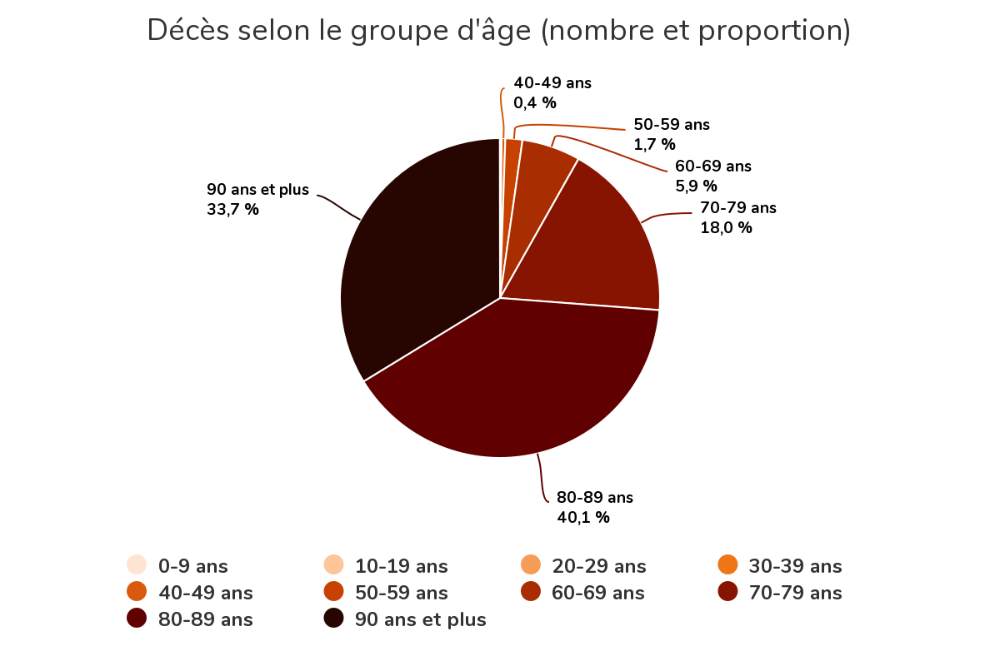

# Décès par semaine au Québec **toutes causes confondues**
[ [English version here](README_english.md) ]

Dernière mise à jour: 2020-06-18

---

**NOTE**: Je ne suis ni statisticien, ni epidémiologue. J'ai une formation en génie informatique et je travaille
dans le domaine de l'IA et de l'apprentissage automatique.

--- 

Le graphique ci-dessous montre le nombre de décès par semaine au Québec,
**toutes causes confondues**.

(Cliquer pour grossir)

- Les données proviennent de l'*Institut de la statistique du Québec*:
   https://www.stat.gouv.qc.ca/statistiques/population-demographie/deces-mortalite/nombre-hebdomadaire-deces.html
   
- La ligne bleue représente le nombre de décès **toutes causes confondues** pour chaque semaine.

- La ligne pointillée représente la moyenne des 5 années précédentes pour chaque semaine.
  
- Les zones grises représentent la *saison grippale* définie ici de novembre à
  mai (semaines CDC 44 à 22).

- Le total des décès **toutes causes confondues** durant chaque saison est inscrit en bleu
  en en-tête. Il représente la somme des semaines pour chaque saison grippales.

- L'excès de décès par rapport à la moyenne est
  représenté par la surface rouge / vert. Il dénote le nombre de décès **toutes causes confondues**, 
  au- dessus / en-dessous de la moyenne pour chaque saison.

.png)
.png)
.png)

## Observations

- Notez les saisons 2013, 2015 et 2018 où il y a un fort surplus de décès.

- Les saisons 2016-2017 et 2019-début-2020 ont été plus clémentes.

- On observe un cycle entre saisons intenses et clémentes.

- Le début 2020 a commencé comme 2019, sous la moyenne. 

- En 2020, l'excès de décès est concentré dans un pic tard en saison. 

- Les dernières semaines du mois de mai sont "provisoires" dans les données de l'ISQ. **Le
  graphique sera mis à jour** lorsqu'elles seront mises à jour.  
  
- L'excès de 2020 est de 10.75%.  Celui de 2015 est de 7.86%

- Le total de la saison 2020 est 7.79% plus élevé que celui de la saison 2018. ((47120-43714)/43714)

- **Il est impossible avec ces données de quantifier le nombre de décès causés par le confinement.**
  On ne connaît pas encore l'effet du confinement par rapport aux chirurgies,
  traitement de cancer reportées, crise cardiaques non traitées, etc. **Il sera
  sans doute impossible de les séparer...** 
  
- Voir NOTES plus bas.

# Total des décès par saison grippale au Québec **toutes causes confondues**

Le graphique à barres ci-dessous illustre le nombre de décès par saison grippale depuis 2011, **toutes causes confondues**.

Les saisons sont définies ici de novembre à mai (semaines CDC 44 à 22).

.png)

# Répartition par groupe d'âge des décès **toutes causes confondues** au Québec

## 70 ans et +
.png)
.png)
.png)
.png)

## 50 à 69 ans
.png)
.png)
.png)
.png)

## 0 à 49 ans
.png)
.png)
.png)
.png)

# Répartition par groupe d'âge des décès **liées à la COVID** au Québec

D'après l'Institut national de santé publique du Québec: https://www.inspq.qc.ca/covid-19/donnees

# NOTES:
1) Les données proviennent de l'Institut de la statistique du Québec:
   
   https://www.stat.gouv.qc.ca/statistiques/population-demographie/deces-mortalite/nombre-hebdomadaire-deces.html

2) Les données passées ont été ajusté pour normaliser l'évolution de la population du Québec:
   https://www.stat.gouv.qc.ca/statistiques/population-demographie

3) Les données récentes contiennent des données provisoires ajustées. 
   
   ISQ:

   > 2019 : Données provisoires (p), corrigées pour tenir compte de la
   > couverture du fichier. Le taux de couverture estimé varie de 99 % pour les
   > premières semaines à 96 % pour les dernières semaines avant la correction.

   > 2020 : Données provisoires (p) corrigées pour tenir compte de la couverture
   > du fichier. Les données sont encore en cours de collecte. Elles seront
   > révisées d’une diffusion à l’autre. Le taux de couverture estimé varie de
   > 95 % pour les premières semaines à près de 80 % pour la plus récente. Ces
   > données doivent être interprétées avec une plus grande prudence.

   > L’estimation des taux de couverture repose sur une analyse de l’historique
   > du rythme de réception et de traitement des bulletins de décès. Des
   > facteurs de correction différentiels ont été appliqués selon le groupe
   > d’âge et le sexe.

   > La situation de crise actuelle pourrait faire que le rythme de réception
   > des bulletins diffère de celui de la période de référence utilisée pour
   > élaborer le modèle d'ajustement. L'interprétation des résultats doit en
   > tenir compte, surtout pour les semaines les plus récentes.

