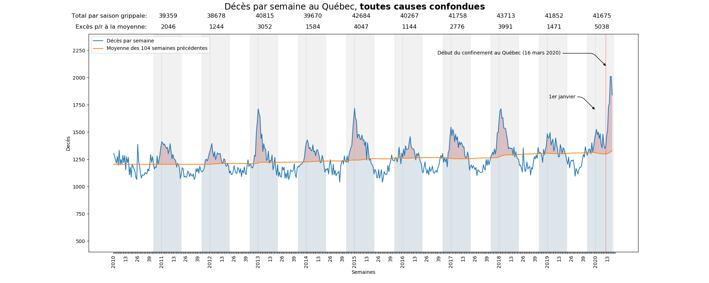
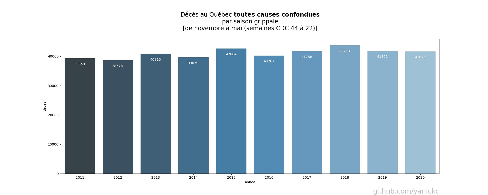
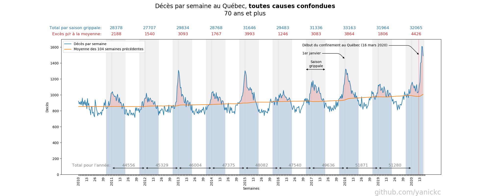
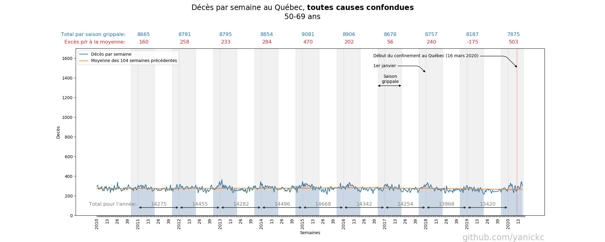
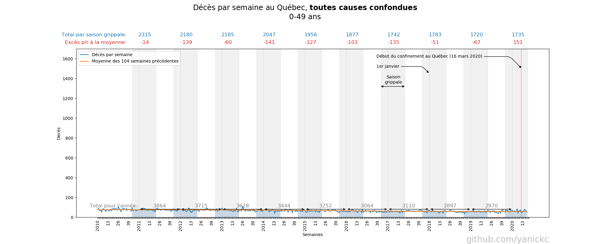
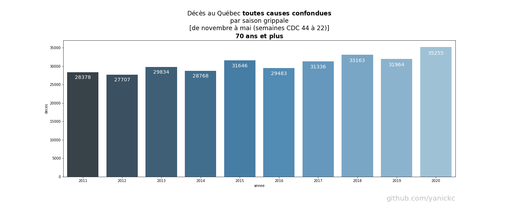
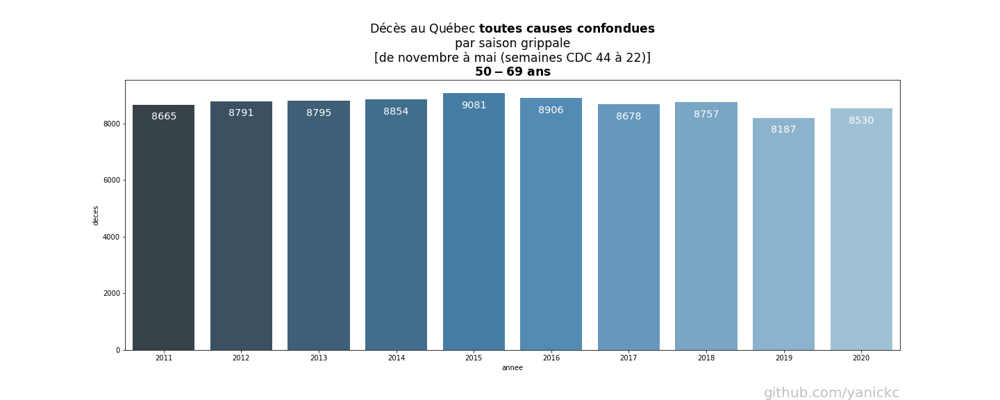

# Décès par semaine au Québec **toutes causes confondues**
[ [English version here](README_english.md) ]

2020-06-15

Le graphique ci-dessous montre le nombre de décès par semaine depuis 2010,
**toutes causes confondues**.

- Les données proviennent de l'Institut de la statistique du Québec:
   https://www.stat.gouv.qc.ca/statistiques/population-demographie/deces-mortalite/nombre-hebdomadaire-deces.html

- La ligne orange représente la moyenne mouvante des 2 années précédentes :
  chaque point de la courbe représente la moyenne des 2 années complètes qui le
  précède.

- Les zones grises représentent la *saison grippale* définie ici de novembre à
  mai (semaines CDC 44 à 22).

- Le total des décès **toutes causes confondues** durant chaque saison est inscrit en bleu
  en en-tête. Il représente la somme des surfaces bleue et rouge pour
  chaque saison.

- L'excès de décès par rapport à la moyenne des 2 années précédentes est
  représenté par la surface rouge. Il dénote le nombre de décès **toutes causes
  confondues**, au dessus de la moyenne pour chaque saison.

### Observations

- Notez les saisons 2013, 2015 et 2018 où il y a un fort surplus de décès.

- Les saisons 2016 et 2019 ont été plus clémentes.

- On observe un cycle entre saisons intenses et clémentes.

- Le début 2020 a commencé comme 2019. L'excès de décès est concentré dans un
  pic tard en saison. 

- Les 3 dernières semaines ne sont pas couvertes dans les données de l'ISQ. **Le
  graphique sera mis à jour** lorsqu'elles seront disponibles. D'ici là **on
  peut projeter le total de la saison 2020 à 46390** en utilisant les données
  des semaines 13 à 15, ce qui a pour effet de copier la forme de la courbe en
  "miroir". **Ce qui représenterait 6.12% de hausse par rapport à la saison 2018.**

- On ne connaît pas encore l'effet du confinement par rapport aux chirurgies,
  traitement de cancer reportées, crise cardiaques non traitées, etc. Il sera
  sans doute impossible de les séparer...
  
- Voir NOTES plus bas.

# Total des décès par saison grippale au Québec **toutes causes confondues**

Le graphique à barres ci-dessous illustre le nombre de décès par saison grippale depuis 2010, **toutes causes confondues**.

Les saisons sont définies ici de novembre à mai (semaines CDC 44 à 22).

### Observations

- Notez les saisons 2013, 2015 et 2018 où il y a un fort surplus de décès.

- Les saisons 2016 et 2019 ont été plus clémentes.

- On observe un cycle entre saisons intenses et clémentes.

- Les 3 dernières semaines ne sont pas couvertes dans les données de l'ISQ. **Le
  graphique sera mis à jour** lorsqu'elles seront disponibles. D'ici là **on
  peut projeter le total de la saison 2020 à 46390** en utilisant les données
  des semaines 13 à 15, ce qui a pour effet de copier la forme de la courbe en
  "miroir". **Ce qui représenterait 6.12% de hausse par rapport à la saison 2018.**
  De ce nombre, on ne connaît pas encore l'effet du confinement par rapport aux
  chirurgies, traitement de cancer reportées, crise cardiaques non traitées,
  etc...
  
- Voir NOTES plus bas.

# Répartitions

## Répartition par groupe d'âge des décès **liées à la COVID** au Québec

D'après l'Institut national de santé publique du Québec: https://www.inspq.qc.ca/covid-19/donnees

## Répartition par groupe d'âge des décès **toutes causes confondues** au Québec

# NOTES:
1) Les données proviennent de l'Institut de la statistique du Québec:
   
   https://www.stat.gouv.qc.ca/statistiques/population-demographie/deces-mortalite/nombre-hebdomadaire-deces.html

2) Les données récentes contiennent des données provisoires ajustées. 
   
   ISQ:

   > 2019 : Données provisoires (p), corrigées pour tenir compte de la
   > couverture du fichier. Le taux de couverture estimé varie de 99 % pour les
   > premières semaines à 96 % pour les dernières semaines avant la correction.

   > 2020 : Données provisoires (p) corrigées pour tenir compte de la couverture
   > du fichier. Les données sont encore en cours de collecte. Elles seront
   > révisées d’une diffusion à l’autre. Le taux de couverture estimé varie de
   > 95 % pour les premières semaines à près de 80 % pour la plus récente. Ces
   > données doivent être interprétées avec une plus grande prudence.

   > L’estimation des taux de couverture repose sur une analyse de l’historique
   > du rythme de réception et de traitement des bulletins de décès. Des
   > facteurs de correction différentiels ont été appliqués selon le groupe
   > d’âge et le sexe.

   > La situation de crise actuelle pourrait faire que le rythme de réception
   > des bulletins diffère de celui de la période de référence utilisée pour
   > élaborer le modèle d'ajustement. L'interprétation des résultats doit en
   > tenir compte, surtout pour les semaines les plus récentes.

