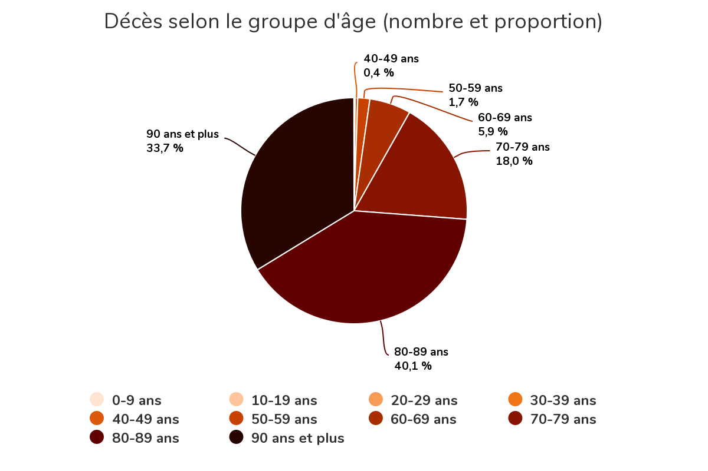

# Deaths per week **all causes combined**
[ [Version française ici](README.md) ]

2020-06-15

The graph below shows the number of deaths per week since 2010,
**all causes combined**.

- The orange line represents the moving average of the previous 2 years: each
   point of the curve represents the average of the 2 complete years preceding it.

- The gray areas represent the *flu season* defined here from November to May
   (weeks CDC 44 to 22).

- The total of **all-cause deaths** during each season is shown in blue in the
   header. It represents the sum of the blue and red areas for each season.

- The excess of deaths compared to the average of the previous 2 years is
   represented by the red surface. It denotes the number of deaths from **all causes
   combined**, above average during each season.

### Observations

- Note the seasons 2013, 2015 and 2018 where there is a large surplus of deaths.

- The 2016 and 2019 seasons were more lenient.

- We observe a cycle between intense and mild seasons.

- The beginning of 2020 started like 2019. The excess death is concentrated in
   one peak late in season.

- The last 3 weeks are not covered in the ISQ data. **The chart will be updated** 
  when available. Until then **we can project the total for the 2020 season to
   46,390** using data from weeks 13 to 15, which has the effect of copying the
   shape of the curve into "mirror". **This would represent a 6.12% increase
   compared to the 2018 season.**  Of this number, we do not yet know the effect
   of confinement in relation to postponed surgery, cancer treatment, untreated
   heart attack, etc ...

- See NOTES below.

# Total deaths per flu season in Quebec **all causes combined**

The bar graph below illustrates the number of deaths per *flu season* since 2010, **all causes combined**.

The seasons are defined here from November to May (weeks CDC 44 to 22).

### Observations

- Note the seasons 2013, 2015 and 2018 where there is a large surplus of deaths.

- The 2016 and 2019 seasons were more lenient.

- We observe a cycle between intense and mild seasons.

- The last 3 weeks are not covered in the ISQ data. **The chart will be updated** 
  when available. Until then **we can project the total for the 2020 season to
   46,390** using data from weeks 13 to 15, which has the effect of copying the
   shape of the curve into "mirror". **This would represent a 6.12% increase
   compared to the 2018 season.**  Of this number, we do not yet know the effect
   of confinement in relation to postponed surgery, cancer treatment, untreated
   heart attack, etc ...
  
- See NOTES below.

# Répartitions

Répartition par groupe d'âge des décès liées à la COVID au Québec,
d'après l'Institut national de santé publique du Québec:

https://www.inspq.qc.ca/covid-19/donnees

# NOTES:
1) The data comes from the Institut de la statistique du Québec .:
   
   https://www.stat.gouv.qc.ca/statistiques/population-demographie/deces-mortalite/nombre-hebdomadaire-deces_an.html

2) Recent data contains adjusted provisional data. 
   
    ISQ:

    > 2019: Preliminary data (p), adjusted to take into account the database
    > completeness. Estimated completeness ranges from 99% for the first weeks to
    > 96% for the last weeks before the adjustment.

    > 2020: Preliminary data (p) adjusted to take into account the database
    > completeness. Data are still being collected and will be revised from one
    > release to the next. Estimated completeness ranges from 95% for the first
    > few weeks to almost 80% for the most recent. These data must be interpreted
    > with greater caution.

    > The estimation of completeness rates is based on an analysis of the history
    > of the rate at which death bulletins are received and processed.
    > Differential correction factors were applied by age group and sex.

    > The current crisis could result in a different rate of receiving bulletins
    > than the reference period used to develop the adjustment model. This
    > should be taken into account when interpreting the results, especially for
    > the most recent weeks.

