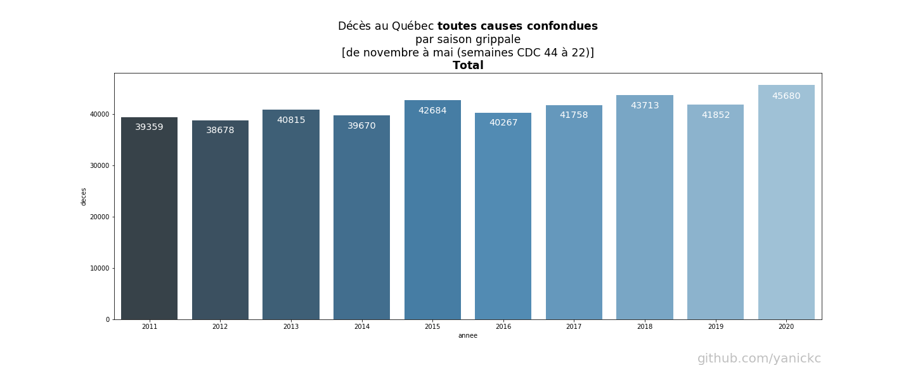

# Deaths per week in Quebec **all causes combined**
[ [Version française ici](README.md) ]

Last updated: 2020-06-18

---
**NOTICE**: I am neither a statistician nor an epidemiologist. I have a background in computer engineering and I work
in the field of AI and machine learning.
---

#### The graph below shows the number of deaths per week since 2010, **all causes combined**.

- The data comes from the *Institut de la statistique du Québec*: 
  https://www.stat.gouv.qc.ca/statistiques/population-demographie/deces-mortalite/nombre-hebdomadaire-deces_an.html

- The blue line represents the number of deaths per week, **all causes combined**

- The orange line represents the moving average of the previous 2 years: each
   point of the curve represents the average of the 2 complete years preceding it.

- The gray areas represent the *flu season* defined here from November to May
   (weeks CDC 44 to 22).

- The total of **all-cause deaths** during each season is shown in blue in the
   header. It represents the sum of the blue and red areas for each season.

- The excess of deaths compared to the average of the previous 5 years for each week is represented by the red surface.
  It denotes the number of deaths from **all causes combined**, above average during each season.

#### Observations

- Note the seasons 2013, 2015 and 2018 where there is a large surplus of deaths.

- The 2016 and 2019 seasons were more lenient.

- We observe a cycle between intense and mild seasons.

- The beginning of 2020 started like 2019, lower than the average. 

- in 2020, the excess death is concentrated in one peak late in the season.

- The last week of May is not covered in the ISQ data. **The chart will be updated** 
  when available. Until then **we can project the 2020 season total (November to May) to 47,165** using data
  week 13 (1485), which has the effect of "mirroring" the shape of the curve. 
  **This would represent 7.88% increase compared to the total for the 2018 season.**
  ((47165-43713) / 43713) 
   
- It is **impossible to quantify the number of deaths caused by the lockdown** with this dataset.
  We do not yet know the effect of lockdowns in relations to surgeries,
  postponed cancer treatment, untreated heart attack, etc. **It will be next to impossible to disentangle...**
   
- See NOTES below.

# Total deaths per flu season in Quebec **all causes combined**

The bar graph below illustrates the number of deaths per *flu season* since 2010, **all causes combined**.

The seasons are defined here from November to May (weeks CDC 44 to 22).

#### Observations

- Note the seasons 2013, 2015 and 2018 where there is a large surplus of deaths.

- The 2016 and 2019 seasons were more lenient.

- We observe a cycle between intense and mild seasons.

- The last week of May is not covered in the ISQ data. **The charts will be updated** 
  when available. Until then **we can project the 2020 season total (November to May) to 47,165** using data
  week 13 (1485), which has the effect of "mirroring" the shape of the curve. 
  **This would represent 7.88% increase compared to the total for the 2018 season.**
  ((47165-43713) / 43713) 

- It is **impossible to quantify the number of deaths caused by the lockdown** with this dataset.
  We do not yet know the effect of lockdowns in relations to surgeries,
  postponed cancer treatment, untreated heart attack, etc. **It will be next to impossible to disentangle...**
  
- See NOTES below.

# Distributions

#### Distribution by age group of deaths **all causes combined** in Quebec

#### Distribution by age group of **COVID-related** deaths in Quebec

According to the National Institute of Public Health of Quebec: https://www.inspq.qc.ca/covid-19/donnees

# NOTES:
1) The data comes from the Institut de la statistique du Québec:
   
   https://www.stat.gouv.qc.ca/statistiques/population-demographie/deces-mortalite/nombre-hebdomadaire-deces_an.html

2) The past data have been adjusted to normalize the evolution of the population of Quebec:
    https://www.stat.gouv.qc.ca/statistiques/population-demographie

3) Recent data contains adjusted provisional data. 
   
    ISQ:

    > 2019: Preliminary data (p), adjusted to take into account the database
    > completeness. Estimated completeness ranges from 99% for the first weeks to
    > 96% for the last weeks before the adjustment.

    > 2020: Preliminary data (p) adjusted to take into account the database
    > completeness. Data are still being collected and will be revised from one
    > release to the next. Estimated completeness ranges from 95% for the first
    > few weeks to almost 80% for the most recent. These data must be interpreted
    > with greater caution.

    > The estimation of completeness rates is based on an analysis of the history
    > of the rate at which death bulletins are received and processed.
    > Differential correction factors were applied by age group and sex.

    > The current crisis could result in a different rate of receiving bulletins
    > than the reference period used to develop the adjustment model. This
    > should be taken into account when interpreting the results, especially for
    > the most recent weeks.

